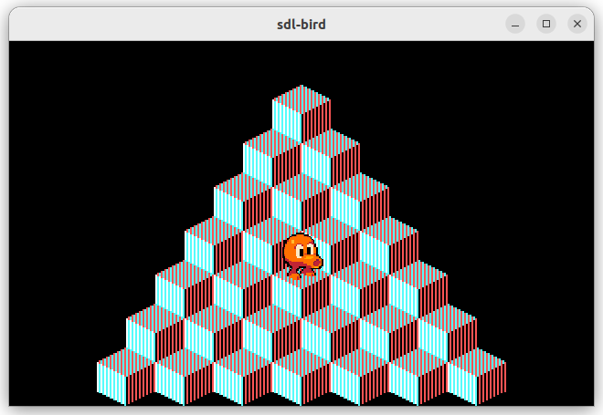

# Sdl-Bird

A simple project to explore the basics of building a game engine in SDL2. The theme I've used is based upon 80's game J-Bird (Q-Bert).

# Features

- game world drawing
- bird figure drawing
- bird figure animation
- input handling



## Compile

```
$ build.sh
```

## Run

```
$ build/sdl-bird
```

## What's left

**IT IS NOT MY INTENTION TO MAINTAIN THIS!**

Feel free to copy or clone this and make your own enhancements to it. Here is some stuff that can be added and improved:

- tecture manager: currently each box of the piramid has its own copy of the box texture. This can by improved be having a texture manager handle these texture resources and share them at will.
- enemies: there aren't any enemies
- score: once you have enemies you can obtain a score
- sprites: the current sprites are just grabbed from the internet, there is so much room for improvement here but for me studying project they were good enough.
- SDL3: migrate to SDL3. There is nothing importing feature wise that we're missing out on, but since SDL3 is on the horizon it may be better to get it done and be future proof.
- escape wings: as with the enemies, there is nothing to escape back to the top of the piramid
- more game elements ...